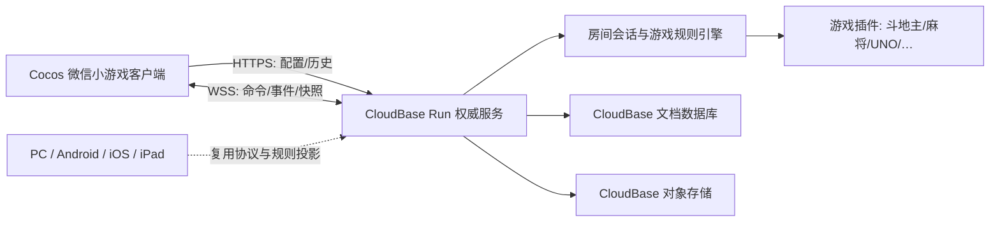

# 系统架构

## 总体结构

## 核心原则

1. **服务端权威**：客户端只发送意图，不能提交“我赢了”或任意新状态。
2. **规则纯函数化**：游戏插件以 `state + command -> events -> state` 运作，便于回放、测试和机器人模拟。
3. **私密视图投影**：同一真实状态按观察者生成不同视图，手牌和身份不下发给无权玩家。
4. **平台适配隔离**：微信登录、触摸、网络生命周期留在客户端适配层，规则层不依赖微信 API。
5. **资源模块化**：大厅在主包；每款游戏使用独立 Asset Bundle 与服务端 manifest。
6. **可恢复**：命令有 requestId，房间有 revision，重连以服务端快照校准。

## 运行时边界

| 层 | 负责 | 不负责 |
| --- | --- | --- |
| Cocos UI | 输入、布局、动效、音效、状态展示 | 规则真值、随机数、身份判定 |
| Client Core | 网络重连、消息路由、本地缓存、平台适配 | 决定胜负、修改权威状态 |
| Protocol | 消息 schema、版本、错误码 | 业务流程实现 |
| Room Runtime | 身份、席位、准备、超时、断线、广播 | 具体牌型规则 |
| Game Module | 初始化、合法命令、事件归约、私密投影、结算 | WebSocket、数据库、微信登录 |
| Repository | 快照、对局索引、幂等与审计 | 解释游戏规则 |

## 房间生命周期

`LOBBY -> STARTING -> PLAYING -> SETTLING -> FINISHED`。断线不会让房间倒退；玩家连接状态独立记录。每个成功命令将 revision 加一，广播新事件或快照。

## 数据策略

- 进程内：活跃房间热状态、连接映射、短时心跳。
- 数据库：房间关键快照、对局元数据、成员索引、幂等 requestId、结算结果。
- 对象存储：大回放、资源包、用户上传内容。
- 客户端：非敏感设置与最后一次连接信息；不缓存其他玩家私密数据。

## 首版容量假设

好友局、小规模内测，单房间 2–12 人；单实例先以数百个轻量房间为压测起点，而不是承诺值。上线前必须以真实消息频率、快照大小与规则 CPU 成本重新容量测试。
