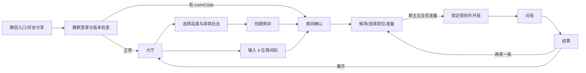
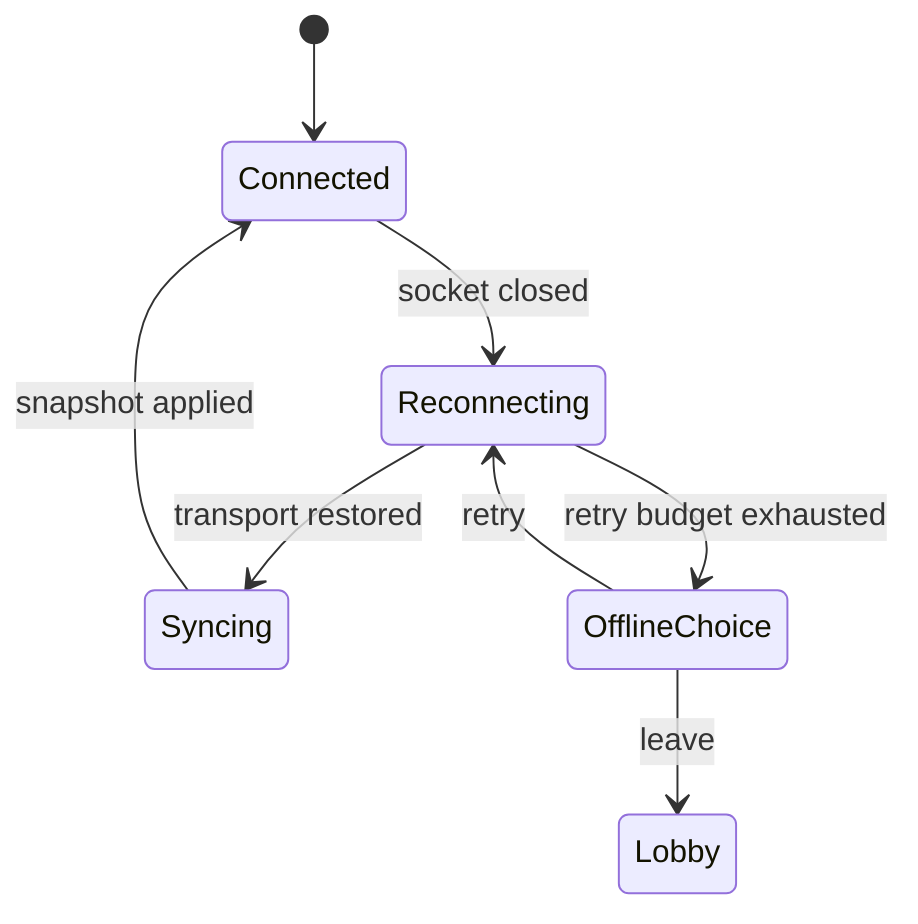

# 核心用户流程

## 首次进入到开局

大厅必须在登录失败时提供重试，不出现永久白屏。好友分享直接进入目标房间时，先展示游戏名、房主和剩余席位，再确认加入，避免误入。

## 对局中的弱网流程

重连浮层不泄漏旧手牌或身份变化；恢复过程中禁止继续提交命令。服务端仍按规则计时，恢复后明确提示是否已托管或自动操作。

## 主要异常

- 房间不存在/已结束：说明原因，返回大厅。
- 版本过低：阻止入局，给出更新动作。
- 房间已满：允许返回或旁观（旁观不是 P0，首版隐藏入口）。
- 房主断线：席位保留；达到规则阈值后移交房主或继续托管，策略由房间规则确定。
- 非法操作：原地保留可操作状态，简短说明为什么不合法，不弹全屏错误。
