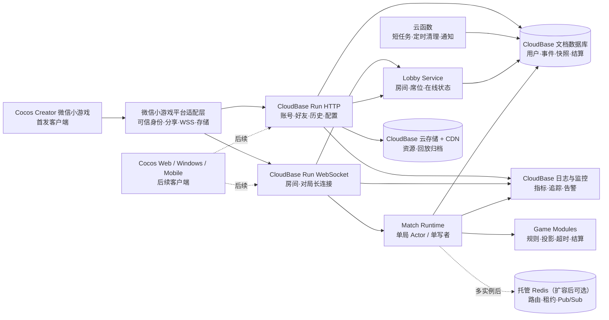
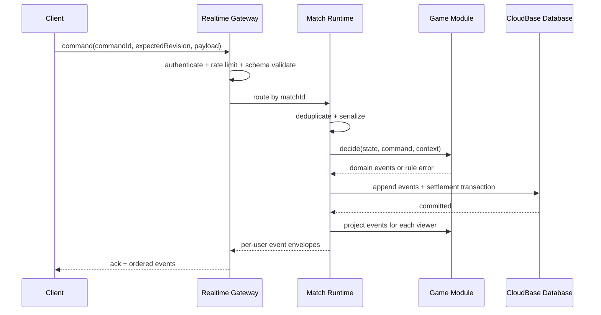

# BoardGameContainer 产品需求与技术方案

| 项目 | 内容 |
| --- | --- |
| 文档版本 | 0.4 |
| 日期 | 2026-07-15 |
| 状态 | 微信小游戏优先策略基线，可用于立项与技术预研 |
| 产品定位 | 好友之间的线上桌游房间与多游戏运行平台 |
| 首发终端 | 微信小游戏 |
| 后续终端 | PC、Android、iOS、iPad、H5 |
| 后端策略 | CloudBase 托管后端，不自行购买或维护 VPS |

### 0.4 工程基线补充

- 首发周期锁定 **Cocos Creator 3.8.8 + TypeScript 5.9.3**；升级引擎必须先完成微信开发者工具与真机回归。
- Node.js 固定 24.x，pnpm 固定 11.7.0；CloudBase CLI 作为项目依赖锁定，不依赖全局安装。
- 已建立 Monorepo、WebSocket 房间服务、协议校验、游戏 SDK、确定性示例规则、CI 和本地冒烟测试骨架。
- 本机模式使用内存仓储，不要求云账号；好友跨网联调再部署 CloudBase Run，账号授权与 AppID 由仓库所有者配置。

### 0.3 策略变更

- 已明确存在复杂桌游、长时对局、丰富动画和多游戏资源管理需求，首发端由普通微信小程序调整为微信小游戏。
- 首发客户端从 Taro 页面应用改为 **Cocos Creator 3.8.8 + TypeScript** 游戏工程。
- Cocos 负责场景、UI、动画、音频、资源包和跨平台构建；纯规则、协议与服务端仍保持 TypeScript 模块边界。
- “不租服务器”定义为不购买和运维云主机；联机游戏仍保留服务端，并部署到 CloudBase Run/微信云托管。
- P0 数据优先使用 CloudBase 文档型数据库与云存储；短任务使用云函数，长连接对局使用支持 WebSocket 的云托管服务。
- PC、Android、iOS、iPad 和 H5 延后到微信小游戏玩法闭环稳定之后，并优先复用 Cocos 工程与纯 TypeScript 包。

## 1. 结论摘要

这不是“把多款桌游分别搬到线上”的项目，而应当建设为两层产品：

1. **通用桌游平台层**：账号、好友、邀请、房间、席位、实时通信、断线重连、结算、回放、聊天、运营和安全。
2. **可插拔游戏层**：每款游戏只实现自己的规则状态机、信息可见性、合法操作、超时策略、结算和桌面表现。

首版不应同时开发斗地主、麻将、狼人杀和多款商业桌游。建议用**一款斗地主规则**打通完整链路，因为它同时覆盖隐藏手牌、随机洗牌、叫地主、回合计时、合法牌型校验、前后台切换重连和结算，能有效验证平台底座。首个闭环稳定后，再以麻将验证“抢响应与复杂计分”，以狼人杀验证“语音、阶段编排和主持能力”，以三国杀类玩法验证“响应窗口、技能触发和效果栈”。

推荐技术路线：

- 共享语言采用 **TypeScript**，把协议、规则类型、回放工具和大部分业务逻辑放在 Monorepo 中。
- 首发客户端采用 **Cocos Creator 3.8.8 + TypeScript** 构建微信小游戏；使用 2D 场景、Prefab、动画系统、Asset Bundle 和 WebGL 渲染牌桌。
- 微信登录、分享、前后台生命周期、云托管连接、开放数据域等能力统一封装在平台适配层，避免规则和游戏场景直接依赖 `wx.*`。
- 服务端采用 **Node.js 模块化单体**，部署在 **CloudBase Run/微信云托管**；HTTP 处理账户和查询，原生 WebSocket 处理房间和对局。
- 云函数只处理短时、无连接状态的任务，不承担持续牌局和对局计时器。
- 对局采用**服务端权威、单局单写者、事件日志 + 快照**模型。客户端只发送意图，不能自行决定发牌、伤害、胜负或计分。
- CloudBase 文档型数据库是 P0 持久化事实源，云存储保存静态资源和可选回放文件；Redis 在多实例扩容前不是必选项。
- 后续 PC 和移动端优先复用 Cocos 场景、协议、领域模型、规则工具与服务端；平台登录、支付、分享、音频和输入仍分别适配。

## 2. 产品目标与边界

### 2.1 产品愿景

让一组现实中的朋友从微信分享卡片进入小游戏，在 3 分钟内创建私密房间、邀请好友、选择游戏并开始一局稳定、公平、可恢复的线上桌游；同一套身份、好友、房间、资源和规则底座可以承载多种复杂度不同的游戏。

### 2.2 首期目标

- 微信用户能够快速进入小游戏，通过分享卡片、二维码或房间码加入私密房间。
- 3 名玩家能够完成一整局约定版本的斗地主。
- 网络短暂中断后，玩家可以回到原席位并恢复到正确局面。
- 所有隐藏信息只发送给有权查看的用户，非法操作由服务端拒绝。
- 对局结果可追溯，规则问题可通过事件日志复现。
- 新增第二款游戏时，不需要复制账号、房间、通信和重连代码。

### 2.3 默认业务假设

以下假设用于让方案可落地，立项时应逐项确认：

- 主要场景是熟人私密房，不涉及真钱、可兑换资产、押注或赌博玩法。
- 首发用户以微信中文用户为主，服务部署在与小游戏和目标用户匹配的 CloudBase 区域。
- 首发只保证微信小游戏体验；PC、Android、iOS、iPad 与 H5 属于后续阶段。
- 不购买和维护 VPS，但接受 CloudBase 托管计算、数据库、存储、日志和流量可能产生按量费用。
- MVP 使用文字、快捷语和表情沟通；实时语音在狼人杀之前作为独立里程碑完成。
- MVP 不做大规模公共匹配、天梯、赛事、商城、UGC 模组或直播观战。
- 首发容量验收基线暂定为 1,000 条同时在线连接、300 个活跃房间，可按实际预算调整。

### 2.4 明确不做

- 不在 MVP 同时上线多款游戏。
- 不把“不租服务器”理解为“没有服务端”；小游戏客户端不得直接裁决规则或互相同步完整状态。
- 不用普通短时云函数承载持续 WebSocket 牌局和长时间对局计时。
- 不允许客户端上传或执行任意规则脚本。
- 不以 Redis 作为对局的唯一存档。
- 不把客户端状态当作胜负和计分依据。
- 不承诺小游戏、Web、桌面和移动端零差异、零适配。
- 未完成授权与合规审查前，不公开发行使用第三方品牌、原文案或原美术的复刻游戏。

## 3. 目标用户与核心场景

### 3.1 用户角色

| 角色 | 目标 | 核心权限 |
| --- | --- | --- |
| 微信用户 | 从分享卡片快速进入 | 创建应用内资料、加入私密房、完成对局 |
| 平台好友 | 持续与固定伙伴游玩 | 应用内好友、房间、历史、举报与屏蔽 |
| 房主 | 组织一场游戏 | 选择规则、管理席位、开始、移交房主、发起解散 |
| 玩家 | 公平完成对局 | 查看自己的私有信息、执行合法操作、重连、查看结算 |
| 运营管理员 | 保障平台秩序 | 查询审计事件、处理举报、封禁、配置公告和游戏开关 |

### 3.2 核心用户旅程

1. 用户从微信打开小游戏，服务端通过微信云环境的可信身份创建或恢复平台账号。
2. 用户创建私密房，选择游戏和规则预设，获得房间码、二维码与分享卡片。
3. 好友点击微信分享进入候场，选择席位并准备。
4. 房主开始后，服务端锁定规则版本与玩家名单，创建对局实例。
5. 玩家按回合操作；所有客户端收到各自权限范围内的状态更新。
6. 玩家断线时保留席位；网络恢复后用快照和增量事件重建状态。
7. 对局结束后展示结算，可再来一局、返回房间或查看允许范围内的回放。

## 4. 功能需求基线

### 4.1 P0：MVP 必须完成

#### 账号与身份

- 使用微信/CloudBase 可信身份建立平台用户，不采信客户端自行提交的 `openid` 或用户 ID。
- 首次进入时创建平台内部用户 ID；业务表只引用内部 ID，不把微信标识暴露为房间码。
- 用户可设置昵称和头像；昵称、头像和文本消息必须经过基础内容安全策略。
- 支持注销、账号状态失效以及必要的数据删除流程。
- M0 明确小游戏隐私授权、昵称头像录入和用户身份迁移流程。

#### 好友与邀请

- 通过平台用户 ID、对局结束页、分享卡片或二维码添加应用内好友；不假设能够直接读取微信通讯录。
- 支持接受、拒绝、删除、屏蔽好友。
- 展示好友在线、在房间、游戏中等粗粒度状态；用户可关闭状态展示。
- 分享路径只携带短期房间令牌，不暴露微信标识或内部数据库 ID。

#### 房间与席位

- 创建私密房，生成短房间码、分享卡片参数和可撤销邀请令牌。
- 先选择游戏品类，再选择具体玩法、地区规则、规则预设和回合时间；首版品类至少包含纸牌类、麻将类与聚会推理。
- 纸牌类可容纳斗地主、炸金花、德州等独立规则包；麻将类可容纳四川麻将、贵州麻将、国标麻将等地区规则包。
- 加入、离开、占座、离座、准备、取消准备。
- 房主可关闭空房、移交房主、移除未开局成员。
- 开局前验证人数、准备状态、规则配置和客户端最低协议版本。
- 开局后规则和游戏版本不可修改。
- 断线不等于离开；席位在可配置宽限期内保留。
- 解散进行中的对局应采用全员确认或规则定义的投票策略，并写入审计事件。

#### 实时对局

- MVP 实现一个写明精确规则版本的斗地主游戏包。
- 服务端完成洗牌、发牌、叫地主、回合推进、牌型校验、出牌比较、超时处理和结算。
- 客户端只展示服务端给出的合法操作提示；服务端仍需独立校验每个命令。
- 命令必须支持幂等：客户端重试不能导致重复出牌或重复结算。
- 每个事件拥有单调递增序号；乱序或缺失时客户端触发补偿同步。
- 回合截止时间由服务端决定，客户端倒计时只作显示。
- 对局固定绑定 `gameId + rulesetVersion + engineVersion`，避免升级后旧对局无法恢复。
- 小游戏通过平台适配层使用可用的 CloudBase WebSocket SDK，或 `wx.connectSocket` 连接 CloudBase Run 的 WSS 域名；M0 必须真机验证具体接入方式，不以云数据库监听代替权威对局协议。

#### 断线重连与恢复

- 客户端维护最近已确认的事件序号和连接会话。
- 小游戏进入后台、网络切换或微信回收连接时一律视为可恢复断线；回到前台后主动探活并重连。
- 短断线优先补发缺失事件；差距过大或状态校验失败时下发个人视角快照。
- 服务端重启后，可从持久化快照和事件日志恢复未完成对局。
- 同一账号多设备进入同一席位时，采用明确策略：MVP 建议“新连接接管，旧连接只读并被提示”。
- 玩家在宽限期后仍未恢复时，按游戏包配置执行托管、超时默认动作或解散，不由客户端决定。

#### 沟通与安全

- 房间文字消息、快捷语和表情。
- 限流、屏蔽、举报和基础敏感内容处理。
- 隐藏手牌、身份、牌堆顺序等私有数据不得进入其他玩家的网络响应、日志前端字段或客户端缓存。
- 房主没有读取其他玩家私有信息的特权。

#### 结算、历史与回放

- 对局结束生成不可重复的结算记录，包含参与者、规则版本、结果和结束原因。
- 用户能查看自己的最近对局。
- 事件日志可供内部问题定位；面向用户的回放必须按游戏规则处理隐藏信息。
- 回放采用同一规则引擎重放，发现状态哈希不一致时标记为不可验证并上报。

#### 管理与运维

- 管理员可按用户、房间、对局 ID 查询必要的审计记录。
- 支持公告、维护模式、游戏开关、最低客户端版本和强制升级策略。
- 记录关键操作但避免记录令牌、密码、完整手牌等敏感信息。

### 4.2 P1：首版稳定后

- H5/PC Web 版本，复用协议、领域模型和服务端。
- Windows 桌面安装包以及 Android、iOS、iPad 客户端适配。
- 实时语音房间；优先采用成熟 RTC 服务或独立 SFU，不把音视频流量经过对局服务。
- 麻将游戏包及至少一种明确的地方规则。
- 观战：延迟、裁剪隐藏信息、限制人数；默认不允许实时全信息观战。
- 好友房间模板、战绩统计、桌面主题、断线托管策略配置。
- 微信游戏消息/分享召回能力、PC 深度链接和桌面自动更新。

### 4.3 P2：平台成熟后

- 狼人杀所需的语音席位、阶段麦克风权限、主持人和举报取证能力。
- 公开匹配、信用分、排行榜、赛事房和俱乐部。
- 多区域部署和跨区域房间策略。
- 经过审核的官方游戏包 SDK；仍不允许用户上传任意服务端代码。
- 机器人与教学关，但机器人决策和规则裁决必须分离。

## 5. 游戏优先级建议

| 游戏方向 | 规则复杂度 | 对平台能力的验证 | 主要风险 | 建议顺序 |
| --- | --- | --- | --- | --- |
| 斗地主 | 中 | 隐藏手牌、洗牌、叫地主、牌型、回合、结算 | 地区规则差异 | 第 1 款 |
| 自研公开信息卡牌游戏 | 中 | 市场、资源、公开状态、移动端交互 | 需要原创设计 | 第 2 款候选 |
| 麻将 | 高 | 多人抢响应、牌墙、复杂和牌与计分 | 地方规则极多、边界案例多 | 第 2～3 款 |
| UNO 类出牌游戏 | 中 | 多人数、方向切换、叠加效果 | 品牌、文本与美术授权 | 获授权或改为原创后 |
| 璀璨宝石类 | 中 | 公共市场、资源预定、回合动作组合 | 品牌和内容授权 | 获授权或原创替代后 |
| SCOUT 类 | 中高 | 手牌顺序约束、特殊组合 | 品牌和内容授权 | 引擎稳定后 |
| 星际探险队类合作吃墩 | 高 | 合作任务、受限沟通、战役状态 | 品牌、内容授权及任务量 | 引擎稳定后 |
| 狼人杀 | 高 | 隐藏身份、阶段、语音、主持、投票 | 语音成本、审核与骚扰治理 | RTC 完成后 |
| 三国杀类效果卡牌 | 很高 | 角色技能、响应窗口、效果栈、扩展包 | 规则组合爆炸及知识产权 | 最后考虑 |

每款游戏进入开发前必须完成独立的《规则规格书》，至少包括：适用人数、完整准备流程、状态阶段图、所有动作前置条件、冲突优先级、超时默认动作、平局与异常结算、隐藏信息矩阵、100 个以上核心与边界案例，以及素材/名称/文本的权利来源。

## 6. 非功能需求与验收指标

### 6.1 稳定性

| 指标 | MVP 验收目标 | 公测目标 |
| --- | --- | --- |
| 服务可用性 | 月度 99.5% | 月度 99.9% |
| 服务端命令处理延迟 | P95 < 50 ms，不含网络 | P95 < 30 ms，不含网络 |
| 目标区域操作可见延迟 | P95 < 300 ms | P95 < 200 ms |
| 网络恢复后的重连 | 95% 在 5 秒内恢复 | 99% 在 5 秒内恢复 |
| 已确认事件丢失 | 0 | 0 |
| 重复命令产生重复效果 | 0 | 0 |
| 首发压测基线 | 1,000 连接、300 活跃房间 | 按运营预测扩容 |

说明：端到端延迟受玩家网络影响，验收时需限定测试地区、网络条件和设备。服务端在确认命令成功前，应确保事件已进入可恢复的持久化路径。

### 6.2 兼容性与体验

- 首发建议横屏，牌桌采用安全区响应式布局；覆盖主流手机宽高比、刘海/挖孔、平板和微信 PC 窗口。
- 每款游戏作为独立 Asset Bundle；核心大厅与首场景进入主包，其他游戏、高清纹理和音频按需分包或远程加载。
- 明确最低微信小游戏基础库版本，在微信开发者工具、至少一台低端 Android 和一台 iPhone 真机验收。
- 小游戏前后台切换、锁屏、网络从 Wi-Fi 切换到蜂窝网络后能够重连，不用动画完成作为规则状态推进条件。
- 建立纹理内存、Draw Call、首场景加载时间、资源包大小和稳定帧率预算，并在 M0 用真机测量后冻结目标。
- 输入、布局、音频和 Cocos 渲染不与规则代码耦合，为后续 PC 与移动端保留平台适配层。

### 6.3 安全与公平

- 所有外部连接使用 CloudBase 提供的 HTTPS/WSS；服务端从可信云上下文获取微信身份，不接受客户端伪造身份字段。
- 服务端进行身份、席位、阶段、回合、资源和规则五层校验。
- 单局只有一个有效写入者；使用租约与 fencing token 防止两个节点同时推进同一局。
- 随机数使用服务端安全随机源，采用无偏洗牌；洗牌结果或随机事件写入受限审计记录。
- 对局日志提供状态哈希链或等价的篡改检测能力。
- 对 HTTP、WebSocket 握手、聊天、邀请和游戏命令分别限流。
- 小游戏端不保存服务端密钥；CloudBase 数据库权限默认拒绝客户端直接写入对局、事件和结算集合。

### 6.4 隐私、内容与发行约束

- 只采集实现账号、社交、对局和安全所需的数据，并提供删除与注销流程。
- 聊天、语音、未成年人使用、实名认证、内容审核、隐私政策、网络游戏资质与备案等要求，应按实际发行地区在上线前进行专项合规评估。
- 不设计真钱、可提现积分、押注或其他赌博导向机制。
- 商业桌游的名称、商标、规则文案、卡面、美术、角色和音频必须确认权利来源；本方案不是法律意见，公开发行前应由专业人员审查。

## 7. 总体技术架构



### 7.1 为什么从模块化单体开始

早期最大的风险是规则、体验和范围，而不是微服务吞吐。账号、好友、房间、对局和后台作为清晰模块部署在一个 CloudBase Run Node.js 服务中；实时网关与对局 Runtime 先同进程运行，同时保留模块边界。这样无需购买 VPS，也无需管理操作系统、反向代理和容器集群。

CloudBase 托管不等于没有服务端。Node.js 服务仍负责权威规则、WebSocket、计时器和持久化，只是实例、域名、TLS、伸缩、日志由云平台管理。P0 封闭测试可使用一个常驻实例降低房间路由复杂度；准备多实例扩容前，必须实现外部房间路由、租约/fencing token 和跨实例消息。

这样可以减少分布式事务、服务发现和运维成本，但架构仍必须遵守以下边界：

- 领域模块不能直接读取其他模块的内部集合。
- 对局运行时只通过 Game SDK 调用具体游戏。
- 连接网关不保存唯一的对局状态。
- CloudBase Run 实例内存全部视为可丢失；文档数据库与云存储承担持久化。
- 云函数只做短任务；不能把长局计时器仅放在一次云函数调用中。
- Redis 若在扩容后启用，其数据也必须允许从数据库重建。

## 8. 客户端方案

### 8.1 推荐组合

- **Cocos Creator 3.8.8 + TypeScript**：首发微信小游戏工程，负责场景、UI、输入、动画、音频、资源和平台构建。
- **Cocos 2D UI 与 WebGL 渲染**：大厅、好友、房间、结算和牌桌统一使用 Scene、Node、Component、Prefab 与 Animation/Tween。
- **Asset Bundle**：`core`、`lobby` 和每款游戏独立成包，支持小游戏分包、远程资源、缓存和资源版本控制。
- **微信小游戏平台适配器**：封装身份、分享、生命周期、WSS、云存储、开放数据域、震动和音频焦点。
- **纯 TypeScript 共享包**：协议 Schema、公共视图、重连状态机、回放验证器和纯规则工具。

Cocos Creator 官方提供微信小游戏构建适配、WebGL 封装、远程资源加载、缓存和版本控制，并支持构建 Web、Windows、Android 与 iOS。因此它比页面框架更适合多款复杂桌游的持续动画、资源分包和后续多端。不过小游戏运行环境不等同于浏览器，所有微信和 CloudBase 能力仍必须经过平台适配层与真机验证。

### 8.2 客户端分层

```text
场景与表现层
  ├─ Boot / Lobby / Room / Settings：Cocos Scenes + Prefabs
  └─ Game Table：Game-specific Cocos Scene + Animation Queue
应用层
  ├─ Session / Friends / Room Controller
  ├─ Match Controller（序号、确认、重连、回放）
  ├─ Scene Flow / Asset Bundle / Audio Controller
  └─ Platform Ports（Identity / Share / Socket / Storage）
共享领域层
  ├─ Protocol Types + Runtime Validation
  ├─ Public Game View Models
  └─ Pure Utilities / Replay Verifier
平台适配层
  ├─ WeChat Game / CloudBase
  ├─ Web Desktop
  └─ Windows / Android / iOS Native
```

客户端不得包含可用于推导其他玩家隐藏信息的完整 `GameState`。它只持有服务端生成的 `PlayerView`，以及用于乐观动画的临时 UI 状态。乐观动画不能提前确认规则结果；服务端拒绝后必须可回滚。

### 8.3 状态管理原则

- 服务器查询数据与实时对局状态分开管理。
- 对局状态只通过有序事件更新，不允许 Cocos 场景节点和组件随意改写。
- 每次事件应用后可计算轻量状态哈希；不一致立即请求快照。
- 动画队列和规则状态分离，快速重连时可跳过过时动画追上最新状态。
- 游戏 UI 依赖 `PlayerView` 和 `ActionHint`，不直接依赖服务端内部类。
- Cocos `Node`、`Component`、`Prefab` 和资源句柄不能进入共享规则状态或网络协议。

### 8.4 资源与场景策略

- `boot`：只包含版本检查、最小字体、进度界面和错误恢复。
- `core`：协议、平台适配器、公共 UI、音频总线和资源管理器。
- `lobby`：大厅、好友、房间和设置。
- `game-<id>`：每款游戏的场景、Prefab、纹理、动画和音频；按进入游戏时加载。
- 首场景与必要引擎模块进入小游戏主包，常用游戏可放小游戏分包，高清/低频资源放 CloudBase 云存储/CDN 作为远程 Bundle。
- 资源清单包含 `gameId + assetVersion + rulesetVersion + minimumClientVersion`；资源更新失败时不得进入不兼容对局。
- 离开游戏后按内存预算释放场景、纹理、音频和不用的 Bundle，避免多款游戏资源累积。

### 8.5 备选方案

| 方案 | 优点 | 主要代价 | 结论 |
| --- | --- | --- | --- |
| Cocos Creator + TypeScript | 微信小游戏适配成熟、2D/3D、资源系统和多端构建完整 | 引擎工程、包体和性能治理成本高于页面应用 | 首发推荐 |
| LayaAir + TypeScript | 偏 2D、小游戏生态和 TypeScript 友好 | 团队生态与长期多端能力需专项验证 | Cocos Spike 失败时比较 |
| PixiJS/Phaser 自行适配 | Web 技术灵活、运行时可控 | 微信小游戏 API、资源、音频和多端适配工作更多 | 不作为首发默认 |
| Unity | 编辑器、特效和 3D 能力强 | 小游戏包体、桥接、构建和团队成本较高 | 未来重 3D 游戏再评估 |

## 9. 服务端与实时通信

### 9.1 服务组成

| 模块 | 职责 |
| --- | --- |
| Identity | 微信可信身份、平台内部用户、注销和账号状态 |
| Social | 好友、邀请、屏蔽、在线状态权限 |
| Lobby | 房间、席位、准备、房主、规则配置、房间生命周期 |
| Realtime Gateway | 连接认证、心跳、订阅、限流、命令确认、消息路由 |
| Match Runtime | 单局所有权、命令串行化、计时器、事件持久化、快照和恢复 |
| Game Registry | 游戏清单、规则版本、兼容协议、开关和资源清单 |
| Settlement | 幂等结算、战绩和统计 |
| Chat & Safety | 消息、敏感内容、举报、屏蔽、留存策略 |
| Admin | 审计查询、用户处置、公告、配置与版本控制 |

### 9.2 HTTP 与 WebSocket 边界

- CloudBase HTTP/`wx.cloud.callContainer`：个人资料、好友列表、历史、公告、资源清单和管理接口。
- CloudBase WebSocket/`wx.cloud.connectContainer`：在线状态、房间变更、对局命令、对局事件、倒计时同步和聊天。
- 云函数：定时清理、异步通知、低频后台任务；不持有房间内存和持续计时器。
- 所有消息使用显式 `protocolVersion`；运行时进行 Schema 校验，不能只依赖 TypeScript 编译类型。
- 大资源、回放导出和日志上传使用 HTTP/对象存储，不经实时连接传输。

### 9.3 命令与事件信封

```ts
type GameCommandEnvelope<T> = {
  protocolVersion: number;
  commandId: string;          // 客户端生成，全局唯一，用于幂等
  roomId: string;
  matchId: string;
  expectedRevision: number;   // 客户端认为的最新事件序号
  type: string;
  payload: T;
};

type GameEventEnvelope<T> = {
  protocolVersion: number;
  matchId: string;
  seq: number;                // 单局严格递增
  eventId: string;
  causedByCommandId?: string;
  serverTime: string;
  type: string;
  payload: T;                 // 已按当前接收者裁剪
  stateHash?: string;
};
```

服务端处理顺序：认证连接 → 校验房间和席位 → 按 `matchId` 路由到唯一 Worker → 去重 `commandId` → 检查 `expectedRevision` → 调用规则模块 → 在事务中追加事件/结算 → 更新内存状态 → 按玩家投影事件 → 返回确认。

### 9.4 一次操作的时序



### 9.5 连接恢复

1. 客户端重连后提交 `matchId`、连接会话和 `lastReceivedSeq`。
2. 网关重新认证，查询该用户是否仍拥有席位。
3. 若事件差距小且增量仍可用，下发 `lastReceivedSeq + 1` 起的个人投影事件。
4. 否则下发最新个人视角快照及其 `snapshotSeq`，再补发之后的事件。
5. 客户端替换规则视图，跳过已过期动画，恢复输入。
6. 如服务端节点故障，新 Worker 使用快照 + 原始事件恢复内部状态，并获得更高 fencing token 后才可接收命令。

首版由微信小游戏平台适配器封装 `SocketTask`/WSS，与 Node.js 标准 WebSocket 服务通信，保持协议轻量并避免 Cocos 场景感知网络细节。无论传输库提供何种自动重连，业务层仍必须实现事件序号、幂等、状态恢复和权限投影；传输连接恢复不能替代对局一致性协议。

## 10. 可插拔游戏规则引擎

### 10.1 核心原则

- **纯规则**：规则模块不访问数据库、网络、文件系统和系统时间。
- **确定性**：相同版本、初始状态和事件序列必须得到相同结果。
- **命令/事件分离**：玩家提交命令，规则模块产出事实事件。
- **私有视图投影**：内部完整状态永不直接序列化给客户端。
- **版本不可变**：已开局对局始终使用创建时的规则包版本。
- **计时器外置**：Runtime 管理真实截止时间，规则包只定义超时应产生的默认命令或事件。
- **随机性可复现**：随机调用由 Runtime 注入并记录结果，规则 reducer 本身不直接调用系统随机函数。

### 10.2 建议接口

```ts
interface GameModule<State, Command, Event, PlayerView> {
  manifest: {
    gameId: string;
    rulesetVersion: string;
    engineApiVersion: string;
    minPlayers: number;
    maxPlayers: number;
  };

  createInitialEvents(ctx: GameContext): Event[];
  decide(state: State, command: Command, ctx: CommandContext): Event[];
  evolve(state: State, event: Event): State;
  project(state: State, viewer: Viewer): PlayerView;
  legalActions(state: State, viewer: Viewer): ActionHint[];
  timeoutCommand(state: State, seatId: string): Command | null;
  result(state: State): GameResult | null;
  assertInvariants(state: State): void;
}
```

`decide` 只做规则判断并产出事件；`evolve` 是确定性 reducer；`project` 根据玩家、公开观众、管理员审计等不同身份裁剪信息。管理员的常规运营页面也不默认获得完整隐藏信息，只有受控审计流程才能访问必要数据。

### 10.3 游戏包目录约定

```text
games/<game-id>/
  manifest.ts
  domain/
    state.ts
    commands.ts
    events.ts
    reducer.ts
    rules.ts
    projection.ts
    scoring.ts
  tests/
    examples/
    properties/
    replays/
  client/
    view-model.ts
    table-scene/
    assets.manifest.ts
  docs/
    rules.zh-CN.md
    edge-cases.md
```

### 10.4 规则复杂度的扩展点

- 斗地主：牌型识别器、牌型比较器、叫地主阶段和出牌阶段。
- 麻将：响应窗口收集所有玩家意图，再按规则优先级一次裁决，不能按网络先到先得。
- 狼人杀：显式阶段图、存活状态、角色私密动作、发言权限和主持动作。
- 三国杀类：需要独立的效果栈、触发窗口、目标选择、响应链和技能作用域；不应在通用房间代码中堆条件分支。
- 合作战役类：任务定义应为经过验证的数据，不执行任意脚本；战役进度与单局状态分开存储。

## 11. 数据模型与持久化

### 11.1 核心实体

| 实体 | 关键字段 |
| --- | --- |
| User | id、status、displayName、avatar、createdAt |
| Identity | userId、wechatSubjectHash、verifiedAt；原始微信标识受限保存 |
| Friendship | requesterId、addresseeId、status、timestamps |
| Room | id、code、hostUserId、gameId、rulesConfig、status、expiresAt |
| RoomSeat | roomId、seatNo、userId、ready、connectionState |
| Match | id、roomId、gameId、rulesetVersion、engineVersion、status、revision |
| MatchParticipant | matchId、seatId、userId、result、disconnectSummary |
| MatchEvent | matchId、seq、type、privatePayloadRef/公共载荷、commandId、createdAt |
| MatchSnapshot | matchId、seq、engineState、stateHash、createdAt |
| Settlement | matchId、version、result、createdAt |
| ChatMessage | roomId、senderId、content、moderationState、createdAt |
| AuditLog | actor、action、target、reason、metadata、createdAt |

### 11.2 事件与快照策略

- CloudBase 集合至少包括 `users`、`friendships`、`rooms`、`matches`、`match_events`、`match_snapshots`、`settlements` 和 `audit_logs`。
- `match_events` 为 `(matchId, seq)` 与 `(matchId, commandId)` 建立唯一或等价幂等约束。
- 命令产生的事件和最终结算通过服务端数据库事务提交；小游戏客户端没有直接写入权限。
- 每个阶段结束或每 20～50 个事件生成快照，实际频率通过恢复耗时测试调整。
- 恢复时先校验规则包版本，再加载最新快照并重放后续事件。
- 事件载荷升级采用显式版本和迁移器；禁止无版本地修改历史事件含义。
- P0 单实例时，在线连接和短期增量缓存在 CloudBase Run 内存中；实例丢失后从数据库恢复。
- 扩为多实例前再引入托管 Redis，保存 `matchId -> workerId + lease + fencingToken`、Pub/Sub 和短期增量缓存；Redis 丢失后仍可从事实源重建。
- 隐藏数据可以按玩家分别生成投影事件，也可以安全保存完整内部事件后在服务端投影；无论采用哪种方式，前端日志与分析平台不能接收完整内部事件。

## 12. 工程结构建议

```text
BoardGameContainer/
  apps/
    game-client/         # Cocos Creator 微信小游戏工程
      assets/
        core/            # 启动、公共 UI、平台接口
        lobby/           # 大厅、好友、房间
        games/           # 各游戏客户端 Asset Bundle
      settings/
      extensions/
      build-configs/     # 微信小游戏、Web、Windows、移动端构建参数
    cloudrun-server/     # CloudBase Run HTTP、WebSocket、Match Runtime
    cloud-functions/     # 短任务、清理与通知
    admin/               # 运营后台
  packages/
    protocol/            # 消息 Schema、类型与版本
    domain/              # 通用用户、房间、对局领域类型
    game-sdk/            # GameModule 接口、测试工具
    game-runtime/        # 对局串行化、计时、事件与恢复
    client-runtime/      # 客户端同步、重连、回放
    platform-wechatgame/ # 微信小游戏、CloudBase、WSS、分享适配
    cocos-common/        # 公共 Cocos 组件与资源加载器
    config/              # lint、tsconfig、构建共享配置
  games/
    doudizhu/
  infra/
    cloudbase/
    docker/              # 本地服务与 CloudBase Run 镜像
    indexes/             # 数据库集合、索引和权限声明
    observability/
  docs/
    adr/
    game-rules/
    runbooks/
  .github/workflows/
```

包管理采用 pnpm workspace；构建缓存可在规模扩大后引入 Turborepo。工程基线文档写明并锁定具体小版本，生产依赖使用 lockfile；升级通过自动化依赖更新、安全扫描和回归测试完成。

## 13. 测试与质量策略

### 13.1 规则测试

- 示例测试：规则文档中的每个例子都映射为可执行测试。
- 边界测试：牌堆耗尽、多人同时响应、最后一张牌、平局、超时、重复命令。
- 属性测试：牌数量守恒、资源不能为负、事件序号单调、结算最多一次、隐藏信息不泄漏。
- 模型测试：随机生成合法命令序列，检查 `assertInvariants`。
- Golden Replay：保存已知事件序列和最终状态哈希，升级规则包时回归。
- 投影测试：为每个身份验证可见字段白名单，禁止通过错误消息泄漏私有状态。

### 13.2 协议与客户端测试

- OpenAPI/消息 Schema 合约测试。
- WebSocket 乱序、重复、丢包、重连、旧协议版本和令牌过期测试。
- Cocos 预览、微信开发者工具与真机端到端测试：分享进入 → 三人加入 → 完整对局 → 前后台重连 → 结算。
- 动画跳过、低帧率、安全区、横屏、微信 PC 窗口和不同 GPU/纹理规格测试。
- 小游戏主包/分包、远程 Asset Bundle、资源缓存、音频焦点、后台切换、弱网、网络切换、基础库最低版本和 CloudBase 环境切换测试。
- 每款游戏验证 Bundle 独立加载和释放，确保连续切换多款游戏后没有场景、纹理、事件监听或计时器泄漏。

### 13.3 故障与容量测试

- 对局中杀死 Worker，验证租约切换、快照恢复和无双写。
- 重启 CloudBase Run 实例，验证内存状态丢失后从快照与事件恢复。
- 注入 CloudBase 数据库慢请求/短暂不可用，确保不错误确认未持久化命令。
- 多实例阶段清空 Redis，验证在线状态降级和持久对局可恢复。
- 基线压测覆盖连接建立、心跳、房间广播、活跃出牌和重连风暴。
- 发布前进行依赖漏洞、密钥泄漏、鉴权绕过和隐藏信息检查。

### 13.4 CI 必过项

`format → lint → typecheck → unit → property/golden replay → contract → integration → Cocos wechatgame build → asset manifest check → cloudrun image build → index/permission check → security scan`

任何游戏规则变更必须同时更新规则版本、规则文档、测试和回放兼容说明。

## 14. 部署、监控与运维

### 14.1 MVP 部署

- 分离 CloudBase 开发、测试、生产环境，禁止小游戏开发版误写生产数据。
- Node.js 模块化单体以容器部署到 CloudBase Run；平台提供域名、HTTPS/WSS、构建、实例与日志，不购买 VPS。
- 封闭测试阶段为实时服务保留至少一个可用实例，避免首个玩家因缩容到零承受明显冷启动；这会产生持续资源费用，应设置预算告警。
- P0 使用 CloudBase 文档型数据库和云存储，开启平台可用的备份与恢复能力；数据库事务只从服务端执行。
- 数据库集合、索引、权限和服务版本全部代码化；发布采用向后兼容的 expand/contract 流程。
- Cocos 构建生成微信小游戏工程；微信开发者工具负责上传、体验版验证、审核和灰度发布。
- 远程 Asset Bundle 发布到 CloudBase 云存储/CDN，资源清单先发布、客户端校验成功后再切换版本；保留最低协议版本与紧急停服开关。
- 正式多实例前增加托管 Redis/消息路由并完成房间所有权迁移测试；不能仅依赖负载均衡让同房玩家碰巧进入同一实例。

### 14.2 核心监控

- 在线连接数、认证失败、心跳超时、重连成功率。
- 房间创建/加入/开局转化率、活跃房间、平均局长、异常结束率。
- 命令处理 P50/P95/P99、规则拒绝率、重复命令率、事件持久化延迟。
- Worker 所有权迁移、租约过期、恢复耗时、状态哈希不一致。
- CloudBase 数据库慢请求、事务冲突、索引命中、容量和备份；多实例后再监控 Redis。
- 云托管实例数、冷启动、WebSocket 断开、资源用量和预算告警。
- 小游戏脚本异常、黑屏、场景切换失败、Bundle/纹理/音频加载失败、帧率、内存、基础库版本分布和前后台恢复成功率。

日志必须带 `requestId / connectionId / roomId / matchId / commandId` 等关联字段，但不得默认写入访问令牌、密码、完整聊天密文或所有玩家手牌。

### 14.3 告警与运行手册

- 大量对局卡死、结算失败、状态哈希不一致为最高优先级告警。
- 为 CloudBase 数据库不可用、云托管实例退出、Worker 双写嫌疑、WebSocket 大量断开和云存储/CDN 故障编写 Runbook。
- 每月至少演练一次备份恢复；每个正式版本验证旧版本客户端的兼容或升级提示。

## 15. 里程碑与实施顺序

以下工期假设团队为 3～5 名有 Web/后端经验的工程师，且美术资源可及时提供；实际排期需按团队和规则复杂度调整。

### M0：需求冻结与技术预研（1～2 周）

- 确认微信小游戏开发主体/AppID、首发横屏策略、目标最低设备、目标地区、语音优先级和 CloudBase 预算。
- 完成斗地主精确规则规格书、状态图、牌型例子和素材权利清单。
- 锁定 Cocos Creator 3.8.8，验证微信小游戏构建、真机分享、远程 Asset Bundle、纹理内存和低端机帧率。
- 开通开发/测试 CloudBase 环境，验证微信可信身份、HTTP/WSS 接入、前后台切换和弱网重连。
- 建立 ADR：Cocos 客户端引擎、资源分包、CloudBase 服务边界、传输协议、持久化、一致性、随机与隐私投影。

**退出条件**：没有未决的核心规则歧义；技术 Spike 能完成两客户端进房并看到同一有序状态。

### M1：纵向切片（2～3 周）

- 初始化 Monorepo、CI、Cocos 微信小游戏工程、CloudBase Run 服务和本地 Docker 调试环境。
- 微信可信身份、分享建房、加入、准备、开始。
- 实现最小 Game SDK 和一个“抽牌/出牌”示例游戏。
- 完成命令幂等、事件序号、个人视图和基础重连。

**退出条件**：自动化测试可从三客户端建房运行到示例结算，杀掉客户端后能恢复。

### M2：斗地主 MVP（4～6 周）

- 斗地主规则包、Cocos 牌桌场景、Prefab、动画、计时、托管和结算。
- 持久化事件、快照、服务重启恢复、历史与内部回放。
- 好友邀请、文字聊天、举报、管理查询。
- 微信小游戏体验版、真机分享链路、远程资源发布和 CloudBase 测试环境。

**退出条件**：规则 Golden Replay 全通过；连续自动完成至少 10,000 局无不变量错误；三人真实弱网测试可完成整局。

### M3：封闭测试与上线加固（3～4 周）

- 容量、故障、安全、隐私和更新演练。
- 可观测性、告警、备份恢复、客服与事故 Runbook。
- 处理规则反馈，冻结首发规则版本。

**退出条件**：达到第 6 节指标；不存在阻断级安全、隐藏信息泄漏或数据恢复问题。

### M4：第二游戏与多端

- 优先用麻将或原创公开信息游戏验证第二类规则模型。
- 使用同一 Cocos 工程先构建 Web Desktop 验证 PC，再构建 Windows、Android 与 iOS 原生版本。
- 多端共享场景、Prefab、规则与协议；微信身份、分享、音频、文件、支付和输入通过平台适配器替换。
- 狼人杀排在 RTC、内容安全、举报与录音/留存策略明确之后。

## 16. 主要风险与应对

| 风险 | 影响 | 应对 |
| --- | --- | --- |
| 首版同时做多款游戏 | 平台和规则都无法稳定 | 只用一款游戏做首个闭环，第二款验证扩展性 |
| 规则口头约定、边做边改 | 争议、死循环、回放失效 | 独立规则规格书、版本不可变、例子自动化 |
| 客户端拥有完整状态 | 作弊与隐私泄漏 | 服务端权威、按玩家投影、网络载荷白名单测试 |
| 把自动重连等同于状态恢复 | 重复操作、状态分叉 | 事件序号、幂等命令、快照、单局单写者 |
| 误以为小游戏不需要服务端 | 作弊、状态分叉、无法重连 | CloudBase Run 托管权威服务端，客户端只发意图 |
| 用短时云函数承载整局游戏 | 冷启动、计时器丢失、连接中断 | 长连接放 CloudBase Run，云函数只做短任务 |
| 小游戏进入后台导致连接断开 | 玩家卡死或误判离开 | 生命周期探活、宽限期、快照与增量恢复 |
| CloudBase 自动扩容后同房跨实例 | 消息不一致或双写 | P0 单实例；多实例前实现路由、租约、Pub/Sub 和 fencing token |
| 托管服务被误认为永久免费 | 欠费停服或成本失控 | 开发/生产隔离、资源上限、预算告警和用量监控 |
| CloudBase 平台绑定 | 迁移成本增加 | 通过仓储、身份和传输适配层隔离 SDK，规则保持纯 TypeScript |
| Cocos 引擎和资源进入主包过多 | 首次加载慢、包体超限、低端机崩溃 | 功能裁剪、Asset Bundle、远程资源、纹理与音频预算 |
| 多款游戏切换后资源泄漏 | 内存持续增长、闪退 | Bundle 生命周期、事件解绑、场景释放和连续切换压测 |
| 引擎升级或微信适配变化 | 构建失败、真机行为变化 | 锁定 LTS、升级分支、构建产物与真机回归 |
| 过早微服务化 | 交付慢、运维复杂 | 模块化单体起步，按容量证据拆分 |
| 承诺全端零适配 | 微信、PC 和移动端体验退化 | 复用 Cocos 场景与共享领域，平台能力仍通过适配器处理 |
| 狼人杀语音低估 | 成本、延迟、骚扰治理 | RTC 独立里程碑，优先成熟服务，完善举报治理 |
| 商业桌游直接复刻 | 下架、索赔、品牌风险 | 授权清单、原创替代、发行前专业审查 |
| 地区合规后置 | 无法上线 | M0 确认发行地区并建立合规清单 |

## 17. 待确认的产品决策

这些问题不会阻止技术预研，但必须在 M0 结束前确定：

1. 微信小游戏 AppID 和开发主体是否已经具备？首发地区和 CloudBase 区域在哪里？
2. 首发采用横屏还是竖屏？建议复杂牌桌优先横屏；目标最低 Android/iPhone 设备是什么？
3. 是否接受 Cocos Creator 3.8.8 作为首发引擎，并在整个首发周期锁定版本？
4. CloudBase 由哪个腾讯云/微信主体开通，测试和正式环境的月度预算上限是多少？
5. 第一个斗地主采用哪套精确叫分、加倍、炸弹、春天、托管和计分规则？
6. MVP 是否必须内置语音？若否，哪一里程碑必须完成？
7. 是否需要公共匹配，还是首年只做好友私密房？
8. 预期峰值同时在线和团队人数是多少？何时从单实例升级为多实例？
9. 商业桌游是否已有授权渠道？没有授权时是否接受原创玩法与美术替代？
10. 对局回放是否在结束后公开所有隐藏信息？视觉方向是轻量 2D、拟真桌面还是强特效？

## 18. 立项后的第一批产物

在开始大量业务编码前，建议先提交以下文件：

- `docs/game-rules/doudizhu-v1.md`：精确规则与边界案例。
- `docs/adr/0001-client-engine.md`：Cocos Creator 版本、回退条件和多端构建策略。
- `docs/adr/0002-authoritative-match-runtime.md`：服务端权威与单局单写者。
- `docs/adr/0003-event-log-and-recovery.md`：事件、快照、幂等和恢复。
- `docs/adr/0004-hidden-information.md`：私有视图、日志和回放权限。
- `docs/adr/0005-cloudbase-boundaries.md`：云函数、CloudBase Run、数据库、存储和未来 Redis 的职责边界。
- `docs/adr/0006-asset-bundles.md`：主包、小游戏分包、远程 Bundle、缓存、版本和释放策略。
- `infra/cloudbase/`：开发/测试环境、集合、索引、权限、预算与部署配置。
- `packages/game-sdk`：最小接口、测试夹具和示例游戏。
- `packages/protocol`：第一个版本化命令/事件 Schema。
- 一套三台真机或三个测试账号的端到端演示，以及 CloudBase Run 实例重启恢复演示。

## 19. 选型依据（官方资料）

- [CloudBase 产品概述](https://cloud.tencent.com/document/product/876/18431)：提供数据库、云存储、身份认证、云函数和云托管等托管后端能力，无需自行管理服务器。
- [CloudBase 应用场景](https://cloud.tencent.com/document/product/876/20232)：官方将微信小游戏、回合制游戏、游戏服务器托管与实时数据同步列为支持场景。
- [CloudBase 云托管](https://cloud.tencent.com/document/product/876/121989/)：支持容器化应用、自动伸缩、按量计费和无需服务器运维。
- [CloudBase WebSocket 文档](https://docs.cloudbase.net/en/run/develop/access/websocket)：说明 CloudBase Run 的 WebSocket 服务；微信小游戏端的具体连接 API 需由平台适配 Spike 验证。
- [CloudBase 文档型数据库](https://docs.cloudbase.net/database/introduce)：支持 JSON 文档、索引、事务和实时推送，并提供小程序/服务端 SDK。
- [CloudBase 事务文档](https://docs.cloudbase.net/en/database/transaction)：事务仅在服务端 Node SDK 使用，适合事件与结算原子提交。
- [Cocos Creator 发布到微信小游戏](https://docs.cocos.com/creator/3.8/manual/zh/editor/publish/publish-wechatgame.html)：提供微信小游戏 WebGL 适配、构建、远程资源、缓存和分包能力。
- [Cocos Creator Asset Bundle](https://docs.cocos.com/creator/3.8/manual/en/asset/bundle.html)：说明独立 Bundle、远程 Bundle 与小游戏分包策略。
- [Cocos Creator Web 构建](https://docs.cocos.com/creator/3.8/manual/en/editor/publish/publish-web.html)：支持 Web Mobile 与 Web Desktop。
- [Cocos Creator 原生平台构建](https://docs.cocos.com/creator/3.8/manual/en/editor/publish/native-options.html)：支持 Android、iOS、Mac 和 Windows 原生发布。

---

本方案的关键取舍是：**用 Cocos Creator 微信小游戏承载复杂桌游表现与多游戏资源，同时把每一局游戏做成可验证、可恢复、不可由客户端作弊的确定性系统。** “不租服务器”通过 CloudBase 托管实现，而不是删除服务端。只要 Cocos 客户端底座、托管服务端、Game SDK、Asset Bundle 和规则版本管理在第一款游戏中得到验证，后续新增 PC/移动端以及麻将、狼人杀或复杂效果卡牌时，复杂度才能主要留在平台适配层和各自游戏包内部。
